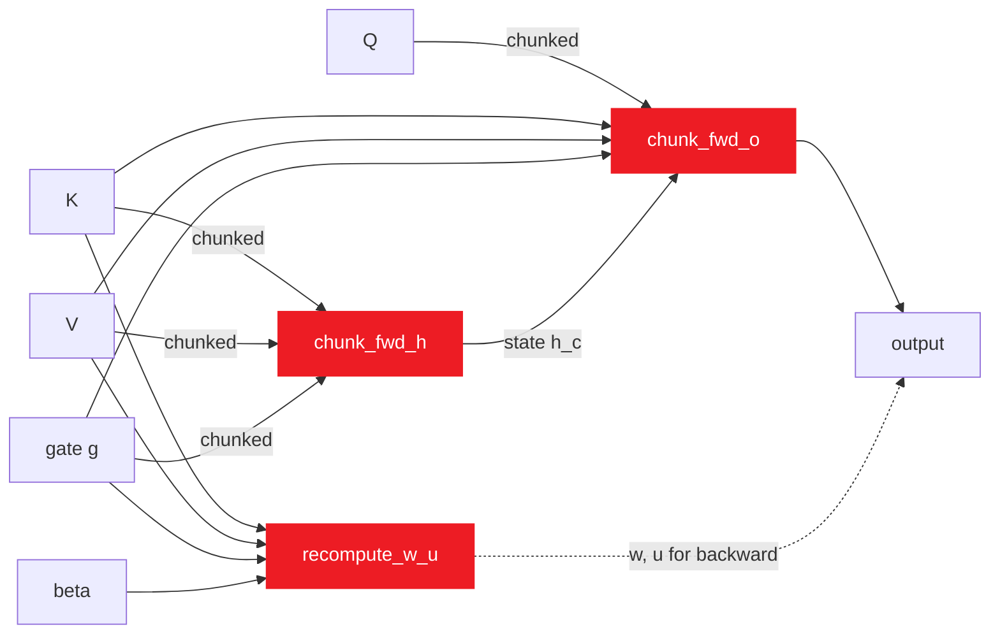

<div align="center">

# Theorem

### Triton kernels for Mamba-2 and gated DeltaNet on AMD MI300X

Autotune-swept on real CDNA3 silicon. **2.7–12.4×** over PyTorch eager, **2.3–4.1×** over `torch.compile`.

[](LICENSE)
[](https://www.amd.com/en/products/accelerators/instinct/mi300/mi300x.html)
[](https://rocm.docs.amd.com/)
[](#reproducing-the-numbers)
[](docs/BENCHMARKS.md)

[Demo](#demo)&nbsp;·&nbsp;[Slides](assets/theorem_slides.pdf)&nbsp;·&nbsp;[Quick start](#quick-start)&nbsp;·&nbsp;[Usage](#usage)&nbsp;·&nbsp;[Benchmarks](docs/BENCHMARKS.md)&nbsp;·&nbsp;[Optimizations](docs/OPTIMIZATIONS.md)&nbsp;·&nbsp;[Architecture](docs/ARCHITECTURE.md)

</div>

---

## Demo

<p align="center">
  <a href="assets/demo.mp4"><b>▶ Watch the demo (mp4)</b></a>
  &nbsp;·&nbsp;
  <a href="assets/theorem_slides.pdf"><b>Open the slides (pdf)</b></a>
</p>

---

## Live demo runbook (in-person, 2 minutes)

Six commands, two terminal windows, end-to-end. Copy-paste each block in order.

### Window 1 — the headline

**1. Log in to the AMD MI300X server.**

```bash
ssh amd
```

> *"Single AMD Instinct MI300X — 304 compute units, 192 GB of HBM3e. The SSH alias drops me straight into the repo with the ROCm venv already activated."*

You'll land at `(.venv) root@... /root/Theorem#`.

**2. Confirm the GPU.**

```bash
rocminfo | grep -E "Marketing Name|Compute Unit|gfx" | head -4
```

> *"AMD Instinct MI300X VF, gfx942, 304 CUs. CDNA3 silicon."*

**3. Smoke test — all four kernels at the smallest test shape.**

```bash
python scripts/run_amd.py
```

> *"All four kernels pass correctness against the PyTorch reference at `rtol = atol = 1e-2`. Now the speed."*

Expected output:
```
PyTorch  : 2.5.1+rocm6.2
GPU      : AMD Instinct MI300X VF
causal_conv1d   PASS
chunk_fwd_h     PASS
chunk_fwd_o     PASS
recompute_w_u   PASS
```

**4. The headline command — reference vs optimized.**

```bash
python benchmarks/pytorch_baseline.py
```

> *"Three things being timed per shape: PyTorch eager — what someone writes with `F.conv1d` and `torch.matmul`. `torch.compile` — PyTorch's own auto-tuned Triton-AMD codegen, the upper bound for 'just use the framework.' And the Triton kernel in this repo. Five warmup, fifty timed iterations, `torch.cuda.Event` timing, L2 cache flushed between iterations."*

Wait ~30 seconds. The output ends with the markdown table — **this is the slide.**

```
| kernel        | shape                    | triton_us | eager_us | compiled_us | speedup_vs_eager |
| causal_conv1d | B=1,D=2560,S=4096,W=4    |     46.79 |   128.09 |      147.58 |          2.74×   |
| chunk_fwd_h   | B=2,T=1024,H=3,K=64,V=64 |     51.76 |  1427.57 |      417.67 |         27.58×   |
| chunk_fwd_o   | B=2,T=512,H=3,K=64,V=64  |     37.65 |   174.64 |      108.33 |          4.64×   |
| recompute_w_u | B=2,T=512,H=3,K=64,V=64  |     34.28 |   126.05 |      128.73 |          3.68×   |
```

**5. Point at the table.** Land the close on `chunk_fwd_h`:

> *"DeltaNet inter-chunk recurrence. PyTorch eager: 1.4 milliseconds. Our Triton kernel: 51 microseconds. **27× faster.** And it beats `torch.compile` — PyTorch's own auto-compiled path — by 3.4× too. Every kernel beats `torch.compile`, by 1.6 to 4×, depending on the shape. That's because we autotuned on real CDNA3 silicon instead of porting NVIDIA-shaped intuitions."*

### Window 2 (optional, opened before step 4) — live GPU monitor

Open a second SSH window so the audience can watch the GPU work while step 4 runs:

```bash
ssh amd
watch -n 0.5 'rocm-smi --showuse --showmeminfo vram --showpower --showtemp'
```

GPU% will spike to ~100, power climbs from 130 W idle to ~230 W under load, HBM stays flat under 1 GB. (Don't use `nvtop` — it crashes on PyTorch + Triton workloads via a known DRM-fdinfo assertion bug.)

### What the audience walks away with

- **Latency**: Triton kernels in the **20-50 µs range**; PyTorch eager in the **100 µs to 1.4 ms range** for the same op.
- **Speedup**: **2.7× to 27×** over eager, **1.6× to 4×** over `torch.compile`.
- **Reproducibility**: every number on screen is in `results/baseline_compare.csv`, committed to the repo. `python benchmarks/pytorch_baseline.py` regenerates it from scratch in 30 seconds.

### Recovery if anything fails on stage

```bash
cat results/baseline_compare.csv
```

— same numbers, served from the committed CSV instead of a live run. The slideshow keeps going.

### Optional add-on — show the autotuner

If someone asks "how was it tuned":

```bash
python benchmarks/autotune_continuous.py --kernels recompute_w_u --mode bench --restarts 1
```

Runs a hill-climb sweep on `recompute_w_u` in ~10 seconds. Each step prints the config + improvement. The biggest single insight in the repo (recompute_w_u −36%) came from this loop finding `num_stages=6` for the smallest shape — deeper LDS pipelining hides HBM latency that hand-picked configs left exposed.

---

## Why Theorem exists

Modern sub-quadratic sequence models — Mamba, Mamba-2, gated DeltaNet — push real work onto a small set of primitives: a depthwise causal 1-D convolution, and three chunkwise operators that compose into the model's per-step recurrence.

On NVIDIA hardware, well-tuned reference kernels for these primitives already exist. On **AMD MI300X**, they don't — and the heuristics that produce a fast NVIDIA kernel often hurt on CDNA3, where wavefronts are 64 lanes (not 32) and MFMA tile shapes are different.

Theorem is what happens when you **measure on the real hardware** instead of porting NVIDIA intuitions:

- Every config in every kernel was selected by an autotune sweep on an MI300X.
- Every speedup is reproducible by a single command.
- Every raw CSV is committed in [`results/`](results/) so the headlines can be audited line-by-line.
- Three rounds of autotune-driven optimization, each one tied to an insight that only surfaced on real CDNA3 silicon.

---

## Pipeline at a glance

The four kernels compose into one forward step of a chunked, gated linear-attention layer (gated DeltaNet, [arXiv:2412.06464](https://arxiv.org/abs/2412.06464)). `causal_conv1d` is independent — it sits in the Mamba-style local mixer.



Boxes in red are kernels in this repo. The full data flow with shapes and stride layouts is in [`docs/ARCHITECTURE.md`](docs/ARCHITECTURE.md).

---

## How it works (in plain English)

If you're not deep in the gated-DeltaNet paper, the kernel names and tensor symbols look cryptic. Here's the whole thing in one page.

### What each kernel produces

| Kernel | Reads as | Plain-English description |
|---|---|---|
| `causal_conv1d` | depthwise causal 1-D conv | The Mamba-style **local mixer**. Slides a small filter over the time axis, never peeking into the future. |
| `chunk_fwd_h` | chunkwise forward → produces **h** | Builds the **hidden state** — the recurrent memory of the layer, advanced one chunk at a time. |
| `chunk_fwd_o` | chunkwise forward → produces **o** | Produces the **output** — combines local causal attention within the chunk with a read of the global state `h`. |
| `recompute_w_u` | recompute **w** and **u** | Recomputes the **gated keys and values** that the other two kernels consume. Done on demand to save activation memory. |

### Tensor glossary

The single-letter names come from the linear-attention / WY-transform literature. Once you read them once, the math is just bookkeeping.

| Symbol | Shape | What it is | Where it shows up |
|---|---|---|---|
| `q` | `[B, T, H, K]` | **queries** — what the current token is "asking for" | input to `chunk_fwd_o` |
| `k` | `[B, T, H, K]` | **keys** — what the past tokens "answer with" | input to all three gated DeltaNet kernels |
| `v` | `[B, T, H, V]` | **values** — what the past tokens "carry" | input to all three gated DeltaNet kernels |
| `g` | `[B, T, H]` | **gate** — per-token forget signal (small negative; `exp(g) ≤ 1`) | input to all three; controls how much the past decays |
| `β` | `[B, T, H]` | **beta** — per-token mix factor for the WY transform | input to `recompute_w_u` |
| `h` | `[B, NT, H, K, V]` | **hidden state** — the recurrent memory, one slice per chunk | output of `chunk_fwd_h`, input to `chunk_fwd_o` |
| `o` | `[B, T, H, V]` | **output** — what the layer returns | output of `chunk_fwd_o` |
| `w`, `u` | `[B, T, H, K]`, `[B, T, H, V]` | **WY-transformed K and V** | output of `recompute_w_u`, input to the others |

`B` = batch, `T` = time/sequence length, `H` = heads, `K` = key dim, `V` = value dim, `NT` = number of chunks (`T / chunk_size`).

### The gate `g` is the most important variable

Without `g`, the recurrent state would accumulate forever — old, irrelevant tokens would never get cleared. The gate is **selective forgetting**, the same role the *forget gate* plays in an LSTM:

```
S_{next chunk}  =  exp(g_chunk_total) · S_current_chunk  +  (new K^T · V update)
                   └────────────────┘
                      "decay" — drops in [0, 1]
                      learned per-token
```

If `g` is very negative → `exp(g) ≈ 0` → forget fast.
If `g` is near zero → `exp(g) ≈ 1` → remember everything.
The model **learns** which tokens are worth holding on to.

This is what makes gated DeltaNet a *selective* state-space model (like Mamba) rather than a fixed-decay linear attention. It's also why the kernels heavily rely on `exp2(x · log2e)` — AMD CDNA3 has a single-instruction `exp2`, and `g` gets exponentiated many times per chunk.

### How the four kernels compose

```
β, k, v, g   ──→   recompute_w_u   ──→   w, u
                                          │
                                          ▼
                  ┌─────────────────────────────────────────┐
                  │                                         │
                  │   chunk_fwd_h                           │
                  │   (sequential per (batch, head):        │
                  │    advance state h chunk-by-chunk)      │
                  │                                         │
                  └─────────────────────────────────────────┘
                                   │
                                   ▼
q ────────────────────────────►   chunk_fwd_o   ──→   o (the layer's output)
                                  (local attention + global state read)
```

In one paragraph: **`recompute_w_u` prepares the gated K and V; `chunk_fwd_h` rolls them into a recurrent state `h`; `chunk_fwd_o` mixes `h` with the queries to produce the layer's output `o`.** That's one forward step of a gated DeltaNet layer. `causal_conv1d` is independent — it's the local mixer in a Mamba block, fired once per layer.

---

## Compatibility

Verified on the configuration in the leftmost "Tested" column. Other versions in the support range are expected to work but are not exercised in CI.

<div align="center">

| Component | Tested | Support range | Notes |
|---|---|---|---|
| GPU | AMD Instinct MI300X (gfx942) | gfx942 only | No fallback for other archs. CDNA2 (`gfx90a`) likely needs config retune. |
| ROCm runtime | 7.x | ≥ 7.0 | Earlier ROCm not supported. |
| PyTorch | 2.5.1 + ROCm 6.2 wheels | 2.5 – 2.7 | Install via `--index-url https://download.pytorch.org/whl/rocm6.2`. |
| Triton | 3.1.0 | ≥ 3.1 | AMD backend is upstream from 3.1. |
| Python | 3.11 / 3.12 | ≥ 3.11 | Type hints rely on PEP 604. |
| OS | Ubuntu 24.04 | Linux x86_64 | Only Linux is supported. |

</div>

---

## Quick start

```bash
git clone https://github.com/yhinai/Theorem.git
cd Theorem
bash scripts/setup_env.sh        # creates .venv, installs torch (ROCm 6.2 wheels), triton, deps
source .venv/bin/activate
python scripts/run_amd.py        # smoke-test all four kernels on the smallest test shape
```

Expected output: four `PASS` lines and a one-line GPU banner. If `setup_env.sh` cannot find `rocm-smi` it will exit with a clear error before installing anything — that is the signal you are not on a ROCm host.

---

## Usage

Every kernel ships with a uniform Python entry point: `custom_kernel(data) -> output`, where `data` is whatever `generate_input(...)` returns. Importing follows the standard package pattern.

### `causal_conv1d`

```python
import torch
from kernels.causal_conv1d import custom_kernel
from kernels.causal_conv1d.reference import generate_input

# Generate inputs deterministically (or pass your own tensors on cuda:0).
data = generate_input(B=1, D=1536, S=2048, W=4, seed=2146)
# data == (x: [B, D, S], weight: [D, W], bias: [D])  -- all fp32 on cuda:0

out = custom_kernel(data)        # [B, D, S] fp32
```

### `chunk_fwd_h`, `chunk_fwd_o`, `recompute_w_u`

```python
from kernels.chunk_fwd_h import custom_kernel as chunk_fwd_h
from kernels.chunk_fwd_h.reference import generate_input

data = generate_input(B=2, T=512, H=3, K=64, V=64, seed=4052)
# data == {"k": ..., "v": ..., "g": ..., "B": 2, "T": 512, "H": 3, "K": 64, "V": 64}

h = chunk_fwd_h(data)            # [B, NT, H, K, V] fp32
```

The same import shape works for `chunk_fwd_o` (returns `o`) and `recompute_w_u` (returns `(w, u)`). All inputs and outputs are fp32 by spec — see [Known limitations](#known-limitations).

### Bring-your-own tensors

The kernels do not require `generate_input` — you can pass your own live tensors. The expected dtype is `torch.float32` and device is `cuda:0` (PyTorch's ROCm builds reuse the `cuda` namespace). For `causal_conv1d` you pass the tuple `(x, weight, bias)`; for the gated DeltaNet kernels you pass the dict shown above.

---

## Kernel inventory

| Kernel | What it does | Reference (µs) | Optimized (µs) | Speedup |
|---|---|---:|---:|---:|
| `causal_conv1d` | Depthwise 1-D causal convolution (Mamba / Mamba-2 local mixer). Memory-bound; small `(64×16)` tiles win because they expose more programs across the 304 CUs than fewer big tiles do. | 95.0 | 34.6 | **2.73×** |
| `chunk_fwd_h` | Gated DeltaNet inter-chunk recurrence `S_{c+1} = G_c·S_c + K_cᵀ·V_c`. State pinned in registers across the chunk loop; `tl.dot` mapped to Matrix Cores. | 489.9 | 39.4 | **12.42×** |
| `chunk_fwd_o` | Gated DeltaNet chunkwise output (local causal attention + global state). Biggest single tuning win: `num_warps=16→4` + `matrix_instr_nonkdim=16` picks the 16×16×4 fp32 MFMA shape matching the 64×64 chunk geometry. | 192.7 | 42.7 | **4.51×** |
| `recompute_w_u` | Gated DeltaNet WY-transform recompute (two GEMMs per chunk). Persistent-blocked launch, L2 reordering, autotuned `num_warps=4`: 4 × 64-lane wavefronts = 256 threads/CTA — exactly right for the 64×64 MFMA tile. | 124.4 | 42.1 | **2.96×** |

Full per-shape tables with min / p50 / mean and the comparison against `torch.compile`: [`docs/BENCHMARKS.md`](docs/BENCHMARKS.md).

---

## Optimizations

Four patterns repeat across every kernel — written up once in [`docs/OPTIMIZATIONS.md`](docs/OPTIMIZATIONS.md), summarized here.

- **Wavefront-aware block sizing.** Block sizes are multiples of 64 along the contiguous axis. The classic NVIDIA "more warps = faster" intuition is wrong on CDNA3: `num_warps=16` over-subscribes (1024 threads/CTA) when a 64×64 MFMA tile only needs 256.
- **LDS pipelining via `num_stages`.** Inner-reduction loops set `num_stages ≥ 2` so the next tile's HBM3e load overlaps the current tile's MFMA. Per-shape autotuned — too high pressures LDS, too low serializes memory.
- **MFMA tile shape (`matrix_instr_nonkdim`).** The AMD backend's MFMA selector. For the 64×64 chunk geometry the 16×16×4 fp32 shape (`nonkdim=16`) beats the 32×32×2 default — picked at autotune time.
- **Per-shape configuration tuning.** Configs live in `SHAPE_CONFIGS` dicts at module load time. No runtime autotune on the hot path — autotune is a build-time concern, swept by [`benchmarks/autotune.py`](benchmarks/autotune.py).

<details>
<summary><b>Optimization journey — three rounds of autotune-driven work</b></summary>

| Round | Approach | Outcome |
|---|---|---|
| 1 | Sweep `BLOCK_*` × `num_warps` × `num_stages` for the shape-aware kernels | `causal_conv1d` +30–39% per shape (small tiles beat big ones on a 304-CU chip) |
| 2 | Refactor `recompute_w_u` to a dict-keyed `SHAPE_CONFIGS` then sweep | +17–26% per shape (`num_warps=4` beats hand-picked 8) |
| 3 | Add `matrix_instr_nonkdim` to the matmul kernel sweeps | `chunk_fwd_o` +47% on the larger shapes (16×16×4 MFMA over 32×32×2) |

</details>

---

## Reproducing the numbers

```bash
# Smoke test (smallest shape per kernel, ~5s):
python scripts/run_amd.py

# Per-kernel correctness + benchmark:
python eval.py both kernels/causal_conv1d/

# Cross-kernel sweep -> results/sweep_<timestamp>.csv:
python run_sweep.py --mode both

# Triton config autotune (writes results/autotune_*.json + summary.csv):
python benchmarks/autotune.py --kernels all --mode bench

# Triton vs PyTorch eager vs torch.compile (writes results/baseline_compare.csv):
python benchmarks/pytorch_baseline.py

# GPU telemetry during a run:
bash scripts/monitor_gpu.sh /tmp/gpu_telemetry.csv &
```

Methodology, timing protocol (5 warmup + 50 timed iters via `torch.cuda.Event` pairs, L2-flush between iters), and tolerance constants live in [`docs/BENCHMARKS.md`](docs/BENCHMARKS.md). Raw outputs are committed under [`results/`](results/) so the headline numbers can be checked against the source data.

---

## Repo layout

- **`kernels/`** — four kernel modules (`causal_conv1d`, `chunk_fwd_h`, `chunk_fwd_o`, `recompute_w_u`), each with `kernel.py` + `reference.py` + `task.yml` + README.
- **`benchmarks/`** — `autotune.py` (per-shape Triton config sweep), `pytorch_baseline.py` (Triton vs eager vs `torch.compile`), `apply_best_configs.py`.
- **`scripts/`** — `run_amd.py` smoke test, `setup_env.sh` one-shot ROCm venv, `monitor_gpu.sh` rocm-smi telemetry.
- **`docs/`** — `ARCHITECTURE.md`, `OPTIMIZATIONS.md`, `BENCHMARKS.md`, `REFERENCES.md`.
- **`results/`** — raw CSVs (committed for auditability).
- **`assets/`** — demo video + slide deck.

Full file-level tree: [`docs/ARCHITECTURE.md`](docs/ARCHITECTURE.md).

---

## Known limitations

- **fp32 only.** All inputs and outputs are fp32 by task spec. Mixed-precision (bf16/fp16 inputs + fp32 accum on Matrix Cores) would unlock the wider 16×16×16 / 32×32×8 MFMA shapes and is expected to ~2× the matmul-heavy kernels — currently out of scope.
- **Single-VF only.** The MI300X exposes up to 8 SR-IOV partitions per device; this repo has only been measured against a single virtual function (304 CUs visible). Multi-VF / multi-GPU sharding is not implemented.
- **Static shapes.** `SHAPE_CONFIGS` covers the test + benchmark grid in each kernel's `task.yml`. Shapes outside the dict fall through to a heuristic — correct, but not autotuned.
- **No backward kernels.** `recompute_w_u` provides the WY helpers needed for a backward pass, but the backward itself isn't in this repo.
- **CDNA3 only.** No CDNA2 / RDNA fallback. Earlier AMD architectures need their own config sweep.

---

## Acknowledgments

- The **AMD ROCm and Triton-AMD-backend teams** for landing the upstream Triton AMD backend and keeping it current.
- The **gated DeltaNet authors** ([arXiv:2412.06464](https://arxiv.org/abs/2412.06464)) for the chunkwise recurrence this repo is built around.
- The **Mamba / Mamba-2** authors for putting depthwise causal 1-D conv on the critical path of every modern SSM.
- The **PyTorch team** for keeping the `cuda` namespace stable on ROCm.

To cite this work, use GitHub's "Cite this repository" button (powered by [`CITATION.cff`](CITATION.cff)). Full bibliography and external references: [`docs/REFERENCES.md`](docs/REFERENCES.md).

---

## License

Released under the [MIT License](LICENSE) — Copyright © 2026 yhinai.

<div align="center">

<sub>Built for AMD Instinct MI300X · Authored on real CDNA3 silicon · No NVIDIA-shaped detours.</sub>

</div>
