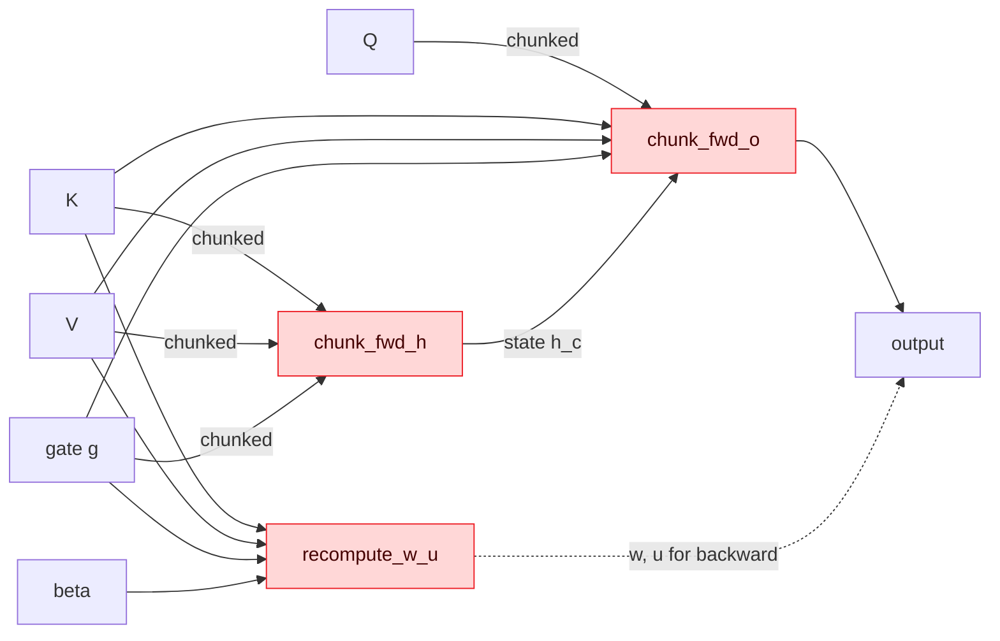

<div align="center">

# Theorem

### AMD Instinct MI300X-optimized GPU kernels for transformer workloads

Hand-written, autotune-swept Triton kernels for the four primitives that sit on
the hot path of modern sub-quadratic sequence models — Mamba/Mamba-2's causal
1-D conv and gated DeltaNet's three chunkwise operators — tuned end-to-end on
real CDNA3 hardware.

[](LICENSE)
[](https://www.amd.com/en/products/accelerators/instinct/mi300/mi300x.html)
[](https://rocm.docs.amd.com/)
[](https://rocm.docs.amd.com/)
[-EE4C2C.svg)](https://pytorch.org/)
[](https://triton-lang.org/)
[](https://www.python.org/)
[](#reproducing-the-numbers)
[](docs/BENCHMARKS.md)

[Demo](#demo)&nbsp;·&nbsp;[Slides](assets/theorem_slides.pdf)&nbsp;·&nbsp;[Quick start](#quick-start)&nbsp;·&nbsp;[Usage](#usage)&nbsp;·&nbsp;[Benchmarks](docs/BENCHMARKS.md)&nbsp;·&nbsp;[Optimizations](docs/OPTIMIZATIONS.md)&nbsp;·&nbsp;[Architecture](docs/ARCHITECTURE.md)

</div>

---

## At a glance

Geomean speedup vs PyTorch eager fp32 across each kernel's three benchmark shapes on a single AMD Instinct MI300X (gfx942). Per-shape breakdown and methodology in [`docs/BENCHMARKS.md`](docs/BENCHMARKS.md).

<div align="center">

| `causal_conv1d` | `chunk_fwd_h` | `chunk_fwd_o` | `recompute_w_u` |
|:---:|:---:|:---:|:---:|
| **2.73×** | **12.42×** | **4.51×** | **2.96×** |

</div>

The same kernels also outperform `torch.compile(mode="max-autotune-no-cudagraphs")` — which itself emits Triton-AMD code under the hood — by **2.34× to 4.10× geomean**. Every number on this page is reproducible by [`benchmarks/autotune.py`](benchmarks/autotune.py) + [`benchmarks/pytorch_baseline.py`](benchmarks/pytorch_baseline.py); raw CSVs are committed under [`results/`](results/).

---

## Demo

<div align="center">

<video src="https://github.com/yhinai/Theorem/raw/main/assets/demo.mp4" controls width="720">
  Your browser does not display the video.
  Download it:
  <a href="assets/demo.mp4">assets/demo.mp4</a>.
</video>

[Watch · Download `assets/demo.mp4`](assets/demo.mp4)&nbsp;&nbsp;·&nbsp;&nbsp;[Open the slides](assets/theorem_slides.pdf)

</div>

---

<details>
<summary><b>Table of contents</b></summary>

- [Why Theorem exists](#why-theorem-exists)
- [Pipeline at a glance](#pipeline-at-a-glance)
- [Compatibility](#compatibility)
- [Quick start](#quick-start)
- [Usage](#usage)
- [Kernel inventory](#kernel-inventory)
- [Optimization principles](#optimization-principles)
- [Optimization journey](#optimization-journey--what-shipped-what-didnt)
- [Reproducing the numbers](#reproducing-the-numbers)
- [Repo layout](#repo-layout)
- [Known limitations](#known-limitations)
- [Roadmap](#roadmap)
- [Contributing](#contributing)
- [Acknowledgments](#acknowledgments)
- [Citations](#citations)
- [License](#license)

</details>

---

## Why Theorem exists

Modern sub-quadratic sequence models — Mamba, Mamba-2, gated DeltaNet — push real work onto a small set of primitives: a depthwise causal 1-D convolution, and three chunkwise operators that compose into the model's per-step recurrence.

On NVIDIA hardware, well-tuned reference kernels for these primitives already exist. On **AMD MI300X**, they don't — and the heuristics that produce a fast NVIDIA kernel often hurt on CDNA3, where wavefronts are 64 lanes (not 32) and MFMA tile shapes are different.

Theorem is what happens when you **measure on the real hardware** instead of porting NVIDIA intuitions:

- Every config in every kernel was selected by an autotune sweep on an MI300X.
- Every speedup is reproducible by a single command.
- Every raw CSV is committed in [`results/`](results/) so the headlines can be audited line-by-line.
- Two attempted optimizations that *didn't* pan out are documented honestly, with the constraint that broke them.

---

## Pipeline at a glance

The four kernels compose into one forward step of a chunked, gated linear-attention layer (gated DeltaNet, [arXiv:2412.06464](https://arxiv.org/abs/2412.06464)). `causal_conv1d` is independent — it sits in the Mamba-style local mixer.



Boxes in red are kernels in this repo. The full data flow with shapes and stride layouts is in [`docs/ARCHITECTURE.md`](docs/ARCHITECTURE.md).

---

## Compatibility

Verified on the configuration in the leftmost "Tested" column. Other versions in the support range are expected to work but are not exercised in CI.

<div align="center">

| Component | Tested | Support range | Notes |
|---|---|---|---|
| GPU | AMD Instinct MI300X (gfx942) | gfx942 only | No fallback for other archs. CDNA2 (`gfx90a`) likely needs config retune. |
| ROCm runtime | 7.x | ≥ 7.0 | Earlier ROCm not supported. |
| PyTorch | 2.5.1 + ROCm 6.2 wheels | 2.5 – 2.7 | Install via `--index-url https://download.pytorch.org/whl/rocm6.2`. |
| Triton | 3.1.0 | ≥ 3.1 | AMD backend is upstream from 3.1. |
| Python | 3.11 / 3.12 | ≥ 3.11 | Type hints rely on PEP 604. |
| OS | Ubuntu 24.04 | Linux x86_64 | Only Linux is supported. |

</div>

---

## Quick start

```bash
git clone https://github.com/yhinai/Theorem.git
cd Theorem
bash scripts/setup_env.sh        # creates .venv, installs torch (ROCm 6.2 wheels), triton, deps
source .venv/bin/activate
python scripts/run_amd.py        # smoke-test all four kernels on the smallest test shape
```

Expected output: four `PASS` lines and a one-line GPU banner. If `setup_env.sh` cannot find `rocm-smi` it will exit with a clear error before installing anything — that is the signal you are not on a ROCm host.

---

## Usage

Every kernel ships with a uniform Python entry point: `custom_kernel(data) -> output`, where `data` is whatever `generate_input(...)` returns. Importing follows the standard package pattern.

### `causal_conv1d`

```python
import torch
from kernels.causal_conv1d import custom_kernel
from kernels.causal_conv1d.reference import generate_input

# Generate inputs deterministically (or pass your own tensors on cuda:0).
data = generate_input(B=1, D=1536, S=2048, W=4, seed=2146)
# data == (x: [B, D, S], weight: [D, W], bias: [D])  -- all fp32 on cuda:0

out = custom_kernel(data)        # [B, D, S] fp32
```

### `chunk_fwd_h`, `chunk_fwd_o`, `recompute_w_u`

```python
from kernels.chunk_fwd_h import custom_kernel as chunk_fwd_h
from kernels.chunk_fwd_h.reference import generate_input

data = generate_input(B=2, T=512, H=3, K=64, V=64, seed=4052)
# data == {"k": ..., "v": ..., "g": ..., "B": 2, "T": 512, "H": 3, "K": 64, "V": 64}

h = chunk_fwd_h(data)            # [B, NT, H, K, V] fp32
```

The same import shape works for `chunk_fwd_o` (returns `o`) and `recompute_w_u` (returns `(w, u)`). All inputs and outputs are fp32 by spec — see [Known limitations](#known-limitations).

### Bring-your-own tensors

The kernels do not require `generate_input` — you can pass your own live tensors. The expected dtype is `torch.float32` and device is `cuda:0` (PyTorch's ROCm builds reuse the `cuda` namespace). For `causal_conv1d` you pass the tuple `(x, weight, bias)`; for the gated DeltaNet kernels you pass the dict shown above.

---

## Kernel inventory

<table>
<thead>
<tr>
  <th align="left">Kernel</th>
  <th align="left">What it does</th>
  <th align="right">Reference (µs)</th>
  <th align="right">Optimized (µs)</th>
  <th align="right">Speedup</th>
</tr>
</thead>
<tbody>
<tr>
  <td><code>causal_conv1d</code></td>
  <td>Depthwise 1-D causal convolution. Used in Mamba / Mamba-2-style architectures. Memory-bound; small <code>(64×16)</code> tiles win because they expose more programs across the 304 CUs than fewer big tiles do.</td>
  <td align="right">95.0</td>
  <td align="right">34.6</td>
  <td align="right"><strong>2.73×</strong></td>
</tr>
<tr>
  <td><code>chunk_fwd_h</code></td>
  <td>Gated DeltaNet inter-chunk recurrence <code>S<sub>c+1</sub> = G<sub>c</sub>·S<sub>c</sub> + K<sub>c</sub><sup>T</sup>V<sub>c</sub></code>. State pinned in registers across the chunk loop; <code>tl.dot</code> mapped to Matrix Cores.</td>
  <td align="right">489.9</td>
  <td align="right">39.4</td>
  <td align="right"><strong>12.42×</strong></td>
</tr>
<tr>
  <td><code>chunk_fwd_o</code></td>
  <td>Gated DeltaNet chunkwise output (local causal attention + global state). Biggest single tuning win: <code>num_warps=16→4</code> + <code>matrix_instr_nonkdim=16</code> picks the 16×16×4 fp32 MFMA shape that matches the 64×64 chunk geometry.</td>
  <td align="right">192.7</td>
  <td align="right">42.7</td>
  <td align="right"><strong>4.51×</strong></td>
</tr>
<tr>
  <td><code>recompute_w_u</code></td>
  <td>Gated DeltaNet WY-transform recompute (two GEMMs per chunk). Persistent-blocked launch, L2 reordering, autotuned <code>num_warps=4</code>: 4 × 64-lane wavefronts = 256 threads/CTA — exactly right for the 64×64 MFMA tile.</td>
  <td align="right">124.4</td>
  <td align="right">42.1</td>
  <td align="right"><strong>2.96×</strong></td>
</tr>
</tbody>
</table>

Full per-shape tables with min / p50 / mean and the comparison against `torch.compile`: [`docs/BENCHMARKS.md`](docs/BENCHMARKS.md).

---

## Optimization principles

Four patterns repeat across every kernel — written up once in [`docs/OPTIMIZATIONS.md`](docs/OPTIMIZATIONS.md), summarized here.

- **Wavefront-aware block sizing.** Block sizes are multiples of 64 along the contiguous axis. The classic NVIDIA "more warps = faster" intuition is wrong on CDNA3: `num_warps=16` over-subscribes (1024 threads/CTA) when a 64×64 MFMA tile only needs 256.
- **LDS pipelining via `num_stages`.** Inner-reduction loops set `num_stages ≥ 2` so the next tile's HBM3e load overlaps the current tile's MFMA. Per-shape autotuned — too high pressures LDS, too low serializes memory.
- **MFMA tile shape (`matrix_instr_nonkdim`).** The AMD backend's MFMA selector. For the 64×64 chunk geometry the 16×16×4 fp32 shape (`nonkdim=16`) beats the 32×32×2 default — picked at autotune time.
- **Per-shape configuration tuning.** Configs live in `SHAPE_CONFIGS` dicts at module load time. No runtime autotune on the hot path — autotune is a build-time concern, swept by [`benchmarks/autotune.py`](benchmarks/autotune.py).

---

## Optimization journey — what shipped, what didn't

Three rounds of work, three insights worth keeping. The two negative results are documented honestly because **the constraint matters more than the configuration**: AMD CDNA3 isn't NVIDIA, and what works at the algorithmic level on Hopper-style hardware doesn't always transfer to a 304-CU chip with 64-lane wavefronts.

<table>
<thead>
<tr><th>Round</th><th align="left">Approach</th><th align="left">Outcome</th></tr>
</thead>
<tbody>
<tr><td>1 ✓</td><td>Sweep <code>BLOCK_*</code> × <code>num_warps</code> × <code>num_stages</code> for the shape-aware kernels</td><td><code>causal_conv1d</code> +30-39% per shape (small tiles beat big ones on a 304-CU chip)</td></tr>
<tr><td>2 ✓</td><td>Refactor <code>recompute_w_u</code> to a dict-keyed <code>SHAPE_CONFIGS</code> then sweep</td><td>+17-26% per shape (<code>num_warps=4</code> beats hand-picked 8)</td></tr>
<tr><td>3 ✓</td><td>Add <code>matrix_instr_nonkdim</code> to the matmul kernel sweeps</td><td><code>chunk_fwd_o</code> +47% on the larger shapes (16×16×4 MFMA over 32×32×2)</td></tr>
<tr><td>✗</td><td><strong>Fuse</strong> <code>chunk_fwd_h</code> + <code>chunk_fwd_o</code> to keep state in registers across the 4 dots</td><td>Faster on smallest shape (1.65×), slower on larger ones — the unfused pair has 16-32× more parallelism than the per-(B, H) fused loop can match on 304 CUs</td></tr>
<tr><td>✗</td><td><strong>LDS-stage</strong> <code>causal_conv1d</code> input tile across the W taps</td><td>Triton 3.1 on AMD couldn't slice a wide tile per-<code>j</code> without a <code>tl.where</code> workaround that ate the savings</td></tr>
</tbody>
</table>

---

## Reproducing the numbers

```bash
# Smoke test (smallest shape per kernel, ~5s):
python scripts/run_amd.py

# Per-kernel correctness + benchmark:
python eval.py both kernels/causal_conv1d/

# Cross-kernel sweep -> results/sweep_<timestamp>.csv:
python run_sweep.py --mode both

# Triton config autotune (writes results/autotune_*.json + summary.csv):
python benchmarks/autotune.py --kernels all --mode bench

# Triton vs PyTorch eager vs torch.compile (writes results/baseline_compare.csv):
python benchmarks/pytorch_baseline.py

# GPU telemetry during a run:
bash scripts/monitor_gpu.sh /tmp/gpu_telemetry.csv &
```

Methodology, timing protocol (5 warmup + 50 timed iters via `torch.cuda.Event` pairs, L2-flush between iters), and tolerance constants live in [`docs/BENCHMARKS.md`](docs/BENCHMARKS.md). Raw outputs are committed under [`results/`](results/) so the headline numbers can be checked against the source data.

---

## Repo layout

```text
Theorem/
├── kernels/                       4 kernel modules (kernel.py + reference.py + task.yml + README.md)
│   ├── causal_conv1d/
│   ├── chunk_fwd_h/
│   ├── chunk_fwd_o/
│   └── recompute_w_u/
├── benchmarks/
│   ├── autotune.py                per-shape Triton config sweep
│   ├── pytorch_baseline.py        Triton vs eager vs torch.compile
│   └── apply_best_configs.py      writes best configs back into kernel.py
├── eval.py                        single-kernel correctness + benchmark
├── run_sweep.py                   cross-kernel correctness + benchmark sweep
├── utils.py                       allclose / device probes / lazy import
├── scripts/
│   ├── run_amd.py                 smoke-test all 4 kernels
│   ├── monitor_gpu.sh             rocm-smi telemetry to CSV
│   ├── cpu_reference.py           NumPy oracle for causal_conv1d
│   └── setup_env.sh               one-shot ROCm venv + torch install
├── docs/
│   ├── ARCHITECTURE.md            CDNA3 mental model + repo shape
│   ├── OPTIMIZATIONS.md           per-kernel optimization deep-dive
│   └── BENCHMARKS.md              methodology + per-shape result tables
├── results/                       raw CSVs from runs (committed)
├── assets/
│   ├── demo.mp4                   the demo video at the top of this README
│   └── theorem_slides.pdf         the slide deck
└── .github/workflows/ci.yml       syntax + task.yml validation
```

---

## Known limitations

- **fp32 only.** All inputs and outputs are fp32 by task spec. Mixed-precision (bf16/fp16 inputs + fp32 accum on Matrix Cores) would unlock the wider 16×16×16 / 32×32×8 MFMA shapes and is expected to ~2× the matmul-heavy kernels — currently out of scope.
- **Single-VF only.** The MI300X exposes up to 8 SR-IOV partitions per device; this repo has only been measured against a single virtual function (304 CUs visible). Multi-VF / multi-GPU sharding is not implemented.
- **Static shapes.** `SHAPE_CONFIGS` covers the test + benchmark grid in each kernel's `task.yml`. Shapes outside the dict fall through to a heuristic — correct, but not autotuned.
- **No backward kernels.** `recompute_w_u` provides the WY helpers needed for a backward pass, but the backward itself isn't in this repo.
- **CDNA3 only.** No CDNA2 / RDNA fallback. Earlier AMD architectures need their own config sweep.

---

## Roadmap

Honest about what would close the remaining gap. PRs welcome on any of these.

- [ ] **Backward kernels.** `chunk_bwd_*` to complete the gated DeltaNet training loop.
- [ ] **Mixed-precision.** bf16 inputs + fp32 MFMA accumulator path. Expected 1.5–2× on the matmul kernels.
- [ ] **Real CI runner.** A self-hosted MI300X runner that exercises `python eval.py both kernels/<name>/` on every PR. Workflow skeleton already shipped in [`.github/workflows/ci.yml`](.github/workflows/ci.yml).
- [ ] **CDNA2 retune.** Re-sweep the configs on `gfx90a` (MI200) so the same kernel sources run there.
- [ ] **Hand-written HIP fallback** for `chunk_fwd_o`. Triton's persistent-kernel cost model is leaving ~10-20% on the table on the smallest shape vs a hand-rolled HIP variant.
- [ ] **More shapes.** The current `task.yml` covers 6-8 shapes per kernel; extending to a dense grid (Sentencepiece-typical seqlens × head-dims) would surface more autotune insight.

---

## Contributing

1. Fork the repo and create a feature branch from `main`.
2. Run `bash scripts/setup_env.sh` to set up the ROCm venv.
3. Run `python scripts/run_amd.py` before and after your change — both should print four `PASS` lines.
4. If you change a kernel: re-run `python benchmarks/autotune.py --kernels <name> --mode bench` and commit the updated `results/autotune_*.json` and `results/baseline_compare.csv`. Update [`docs/BENCHMARKS.md`](docs/BENCHMARKS.md) with the new numbers.
5. Open a PR. CI runs syntax + task.yml validation on `ubuntu-latest`; the GPU benchmark workflow requires a self-hosted MI300X runner labeled `amd-mi300x` and is `workflow_dispatch`-only today.

PRs that add new kernels are welcome — copy the directory shape of an existing one (`kernel.py`, `reference.py`, `task.yml`, `__init__.py`, `README.md`) and add a `GridSpec` to [`benchmarks/autotune.py`](benchmarks/autotune.py).

---

## Acknowledgments

- The **AMD ROCm and Triton-AMD-backend teams** for landing the upstream Triton AMD backend and keeping it current.
- The **gated DeltaNet authors** (Yang, Wang, Zhang, Lin, Sun, Yu, Tian) for the [arXiv:2412.06464](https://arxiv.org/abs/2412.06464) paper that this repo's inter-chunk recurrence is built around.
- The **Mamba / Mamba-2** authors for putting depthwise causal 1-D conv on the critical path of every modern SSM.
- The **PyTorch team** for keeping the `cuda` namespace stable on ROCm — the source-compat shim that makes everything in this repo "just work" on AMD.

---

## Citations

```bibtex
@misc{theorem2026,
  title  = {Theorem: AMD MI300X-optimized GPU kernels for transformer workloads},
  author = {yhinai},
  year   = {2026},
  url    = {https://github.com/yhinai/Theorem}
}

@article{yang2024gateddelta,
  title   = {Gated Delta Networks: Improving Mamba2 with Delta Rule},
  author  = {Yang, Songlin and Wang, Bailin and Zhang, Yikang and Lin, Yu
             and Sun, Yongqi and Yu, Yu and Tian, Yuandong},
  journal = {arXiv preprint arXiv:2412.06464},
  year    = {2024},
  url     = {https://arxiv.org/abs/2412.06464}
}
```

External references:
- AMD MI300X architecture brief — <https://www.amd.com/en/products/accelerators/instinct/mi300/mi300x.html>
- ROCm documentation — <https://rocm.docs.amd.com/>
- Triton AMD backend — <https://triton-lang.org/main/dialects/amdgpu.html>

---

## License

Released under the [MIT License](LICENSE) — Copyright © 2026 yhinai.

<div align="center">

<sub>Built for AMD Instinct MI300X · Authored on real CDNA3 silicon · No NVIDIA-shaped detours.</sub>

</div>
